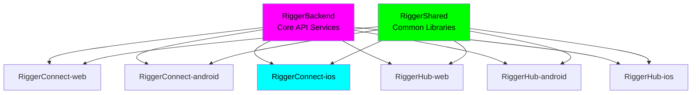

# RiggerConnect iOS

🏗️ **A ChaseWhiteRabbit NGO Initiative**

## 📍 Repository Location & Structure

**Current Location**: `/Users/tiaastor/Github/tiation-repos/RiggerConnect-ios/`

This repository is part of the **Tiation Enterprise Repository Structure**, specifically designed to house **ChaseWhiteRabbit NGO's** technology initiatives following enterprise-grade development practices.

### 🏗️ Enterprise Ecosystem
- **Repository Collection**: [Enterprise Repository Index](https://github.com/tiaastor/tiation-repos/blob/mahttps://github.com/tiaastor/tiation-repos/blob/main/ENTERPRISE_REPOSITORY_INDEX.md)
- **Web Platform**: [RiggerConnect-web](https://github.com/tiaastor/RiggerConnect-web/)
- **Android Companion**: [RiggerConnect-android](https://github.com/tiaastor/RiggerConnect-android/)
- **Backend Services**: [RiggerBackend](https://github.com/tiaastor/RiggerBackend/)
- **Shared Libraries**: [RiggerShared](https://github.com/tiaastor/RiggerShared/)
- **Operations Hub**: [RiggerHub-ios](https://github.com/tiaastor/RiggerHub-ios/), [RiggerHub-web](https://github.com/tiaastor/RiggerHub-web/)

### 🌟 NGO Integration
As a **ChaseWhiteRabbit NGO Initiative**, this project adheres to:
- ✅ **Enterprise-grade development practices**
- ✅ **Ethical technology standards**
- ✅ **Worker empowerment focus**
- ✅ **DevOps best practices with CI/CD**
- ✅ **Open development transparency**

## 🔗 Related Repositories

### Core Platform Components

| Repository | Platform | Description | GitHub SSH URL |
|------------|----------|-------------|----------------|
| **RiggerConnect-web** | Web | Business-focused recruitment platform | `git@github.com:tiation/RiggerConnect-web.git` |
| **RiggerConnect-android** | Android | Mobile business management app | `git@github.com:tiation/RiggerConnect-android.git` |
| **RiggerConnect-ios** | iOS | Mobile business management app | `git@github.com:tiation/RiggerConnect-ios.git` |
| **RiggerConnect-capacitor** | Cross-platform | Cross-platform mobile framework | `git@github.com:tiation/RiggerConnect-capacitor.git` |
| **RiggerHub-web** | Web | Worker-focused job search platform | `git@github.com:tiation/RiggerHub-web.git` |
| **RiggerHub-android** | Android | Mobile worker app | `git@github.com:tiation/RiggerHub-android.git` |
| **RiggerHub-ios** | iOS | Mobile worker app | `git@github.com:tiation/RiggerHub-ios.git` |
| **RiggerBackend** | API/Backend | Core backend services and APIs | `git@github.com:tiation/RiggerBackend.git` |
| **RiggerShared** | Multi-platform | Shared libraries and components | `git@github.com:tiation/RiggerShared.git` |

### Enterprise Integration Architecture



### ChaseWhiteRabbit NGO License Framework

All repositories in the Rigger ecosystem are licensed under **GPL v3**, ensuring:
- ✅ **Open Source Transparency**: Complete code visibility and community auditing
- ✅ **Ethical Technology Standards**: Algorithmic fairness and bias prevention
- ✅ **Worker Empowerment Focus**: Technology serving users, not corporate profits
- ✅ **Community Ownership**: Improvements benefit the entire rigger community
- ✅ **Corporate Responsibility**: Commercial use must remain open and accessible

## 🎯 Application Overview

RiggerConnect iOS is an enterprise-grade mobile application designed to revolutionize networking and career development for riggers in the construction, oil & gas, and industrial sectors. This native iOS app provides professional riggers with powerful tools for networking, skill development, job discovery, and career advancement.

## 🎯 Project Purpose

As part of ChaseWhiteRabbit NGO's mission to empower blue-collar workers through technology and opportunity, RiggerConnect iOS bridges the gap between traditional rigging professions and modern digital networking. Our platform enables riggers to:

- **Connect** with industry professionals and mentors
- **Discover** career opportunities and skill development paths
- **Share** safety best practices and technical knowledge
- **Advance** their careers through targeted professional networking
- **Access** industry-specific training and certification resources

## 🚀 Technology Stack

- **Language**: Swift 5.9+
- **Framework**: UIKit with SwiftUI integration
- **Architecture**: MVVM with Combine framework
- **Minimum iOS**: 15.0
- **Target iOS**: 17.0+
- **Design System**: Custom design system with accessibility support
- **Networking**: URLSession with async/await
- **Authentication**: JWT tokens with Keychain storage
- **Push Notifications**: APNs with Firebase Cloud Messaging
- **Analytics**: Firebase Analytics
- **CI/CD**: Xcode Cloud + Fastlane

## Project Structure

```
├── .github/workflows/    # CI/CD pipelines
├── configs/             # Configuration files
├── docs/               # Documentation
│   ├── api/           # API documentation
│   ├── architecture/  # System architecture docs
│   ├── deployment/    # Deployment guides
│   └── development/   # Development guides
├── scripts/           # Build and deployment scripts
├── src/              # Source code
└── tests/            # Test suites
```

## Features

- Native iOS development with Swift
- Ethical, enterprise-grade development practices
- DevOps best practices integration
- Modern, striking UI/UX design
- CI/CD ready architecture

## Quick Start

1. Clone the repository
2. Open in Xcode
3. Configure build schemes
4. Run on device/simulator

## Contributing

Please follow our enterprise development standards and ensure all code meets our ethical guidelines.

## 👥 Contact & Team

### Project Leaders

**Jack Jonas** - Karratha Crane Operator & Industry Expert  
📧 [jackjonas95@gmail.com](mailto:jackjonas95@gmail.com)  
🏗️ **Industry Expertise**: Seasoned rigger, crane operator, and heavy vehicle mechanic operating in the demanding environment of Western Australia's mining sector. Jack's practical insights ensure this iOS application addresses the real challenges faced by riggers who need reliable mobile tools for career management and networking in remote locations.

**Tia** - ChaseWhiteRabbit NGO Technical Leadership  
📧 [tiatheone@protonmail.com](mailto:tiatheone@protonmail.com)  
🌟 **NGO Mission-Driven Leadership**: Swedish software developer and founder of ChaseWhiteRabbit NGO, committed to creating ethical, worker-empowering software solutions. Tia's dedication to supporting valuable blue-collar professions drives the development of tools that prioritize user empowerment over corporate profit.

### Primary Maintainers

For inquiries related to the Rigger ecosystem, please contact our primary maintainers:

- **Jack Jonas**: [jackjonas95@gmail.com](mailto:jackjonas95@gmail.com)
  - **Role**: Rigger Crane Operator & Heavy Vehicle Mechanic, based in Karratha, WA
  - **Expertise**: Practical rigging operations, safety protocols, and industry requirements

- **Tia Astor**: [tiatheone@protonmail.com](mailto:tiatheone@protonmail.com)
  - **Role**: Swedish Software Developer with ChaseWhiteRabbit NGO
  - **Mission**: Creating ethical technology to empower blue-collar workers

These maintainers oversee the development and coordination of the entire Rigger platform ecosystem, including RiggerConnect, RiggerHub, RiggerBackend, and RiggerShared repositories.

### Special Mentions

**Jack Jonas** brings invaluable real-world experience as a rigger crane operator and heavy vehicle mechanic operating in the demanding environment of Western Australia's mining sector. His practical insights ensure this iOS application addresses the real challenges faced by riggers who need reliable mobile tools for career management and networking in remote locations.

**Tia Astor** develops this technology as part of ChaseWhiteRabbit NGO's commitment to creating ethical, worker-empowering software solutions. Her dedication to supporting valuable blue-collar professions drives the development of tools that prioritize user empowerment over corporate profit.

### Project Vision

This SaaS platform is designed to provide Jack and riggers like him with essential services in the transient rigging industry, while supporting Tia's humanitarian goals through ChaseWhiteRabbit NGO. Together, they're creating technology that elevates workers rather than replacing them.

### Enterprise Standards & Compliance

- **GPL v3 License**: Ensures all improvements remain freely accessible and ethically governed
- **Enterprise-Grade Security**: Biometric authentication, encrypted data storage, and secure API communications
- **CI/CD Pipeline**: Automated testing and deployment through Xcode Cloud and GitLab CI/CD
- **Cross-Platform Consistency**: Maintains feature parity with Android and web platforms
- **iOS Native Excellence**: Leverages native iOS capabilities for optimal performance and user experience

## 🤝 Project Team & Purpose

This project is part of a broader suite of repositories aimed at supporting the **transient rigging and heavy lifting industry** in Western Australia and beyond.

🔗 **Related Repositories**:

* [`RiggerConnect-web`](https://github.com/ChaseWhiteRabbit/RiggerConnect-web) - Professional networking platform for construction workers
* [`RiggerConnect-android`](https://github.com/ChaseWhiteRabbit/RiggerConnect-android) - Native Android mobile networking application
* [`RiggerConnect-ios`](https://github.com/ChaseWhiteRabbit/RiggerConnect-ios) - Native iOS mobile networking application
* [`RiggerConnect-capacitor`](https://github.com/ChaseWhiteRabbit/RiggerConnect-capacitor) - Cross-platform mobile app built with Ionic Capacitor
* [`RiggerHub-web`](https://github.com/ChaseWhiteRabbit/RiggerHub-web) - Operations management hub for business users
* [`RiggerHub-android`](https://github.com/ChaseWhiteRabbit/RiggerHub-android) - Native Android operations management application
* [`RiggerHub-ios`](https://github.com/ChaseWhiteRabbit/RiggerHub-ios) - Native iOS operations management application
* [`RiggerShared`](https://github.com/ChaseWhiteRabbit/RiggerShared) - Shared libraries, components, and utilities
* [`RiggerBackend`](https://github.com/ChaseWhiteRabbit/RiggerBackend) - Core backend services and APIs for the Rigger ecosystem

📬 **Contact**:
For questions, ideas, or collaboration inquiries, please reach out to:

* **Jack Jonas** – [jackjonas95@gmail.com](mailto:jackjonas95@gmail.com)
* **Tia** – [tiatheone@protonmail.com](mailto:tiatheone@protonmail.com)

---

### 🙌 About the Founders

**Jack Jonas** is a seasoned rigger, crane operator, and heavy vehicle mechanic based in Karratha, Western Australia. His firsthand experience in the field shapes the practical backbone of this platform.

**Tia** is a Swedish software developer and founder of the NGO **ChaseWhiteRabbit**, which is dedicated to building inclusive, systemic solutions to complex challenges.

Together, they created this SaaS platform to:

* Help connect riggers, doggers, and crane operators to real work opportunities.
* Support better logistics, transparency, and compliance in the field.
* Fund and sustain the good work being done by **ChaseWhiteRabbit** in disadvantaged communities.

### Cross-Platform Ecosystem Links

Explore the complete Rigger ecosystem:

- **Web Platforms**:
  - 🌐 [RiggerConnect-web](../RiggerConnect-web/) - Professional networking web platform
  - 🌐 [RiggerHub-web](../RiggerHub-web/) - Operations management hub

- **Mobile Applications**:
  - 📱 [RiggerConnect-android](../RiggerConnect-android/) - Android networking companion
  - 📱 [RiggerHub-android](../RiggerHub-android/) - Android operations management
  - 📱 [RiggerHub-ios](../RiggerHub-ios/) - iOS operations management

- **Backend & Shared**:
  - ⚙️ [RiggerBackend](../RiggerBackend/) - Core API services and backend infrastructure
  - 📚 [RiggerShared](../RiggerShared/) - Shared libraries and utilities across platforms

These interconnected repositories form a comprehensive ecosystem designed to serve the rigging industry across all platforms and use cases.

## License

This project is licensed under the **GNU General Public License v3.0** - see the [LICENSE](LICENSE) file for details.

### Why GPL v3?
As an ethical NGO initiative, we believe in:
- **Open Source Transparency**: All code visible and auditable
- **Community Ownership**: Improvements benefit everyone
- **Corporate Responsibility**: Commercial use must remain open
- **Worker Protection**: Technology that can't be locked away from users
