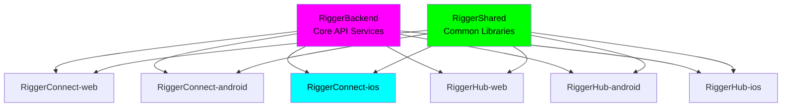

# RiggerConnect iOS

🏗️ **A ChaseWhiteRabbit NGO Initiative**

## 📍 Repository Location & Structure

**Current Location**: `/Users/tiaastor/Github/tiation-repos/RiggerConnect-ios/`

This repository is part of the **Tiation Enterprise Repository Structure**, specifically designed to house **ChaseWhiteRabbit NGO's** technology initiatives following enterprise-grade development practices.

### 🏗️ Enterprise Ecosystem
- **Repository Collection**: [Enterprise Repository Index](../ENTERPRISE_REPOSITORY_INDEX.md)
- **Web Platform**: [RiggerConnect-web](../RiggerConnect-web/)
- **Android Companion**: [RiggerConnect-android](../RiggerConnect-android/)
- **Backend Services**: [RiggerBackend](../RiggerBackend/)
- **Shared Libraries**: [RiggerShared](../RiggerShared/)
- **Operations Hub**: [RiggerHub-ios](../RiggerHub-ios/), [RiggerHub-web](../RiggerHub-web/)

## 🔗 Related Repositories

### Core Platform Components

| Repository | Platform | Description | GitHub SSH URL |
|------------|----------|-------------|----------------|
| **RiggerBackend** | API | Core backend services and APIs | `git@github.com:tiation/RiggerBackend.git` |
| **RiggerConnect-web** | Web | Professional networking platform | `git@github.com:tiation/RiggerConnect-web.git` |
| **RiggerConnect-android** | Android | Mobile networking app | `git@github.com:tiation/RiggerConnect-android.git` |
| **RiggerHub-web** | Web | Operations management hub | `git@github.com:tiation/RiggerHub-web.git` |
| **RiggerHub-android** | Android | Mobile operations hub | `git@github.com:tiation/RiggerHub-android.git` |
| **RiggerHub-ios** | iOS | Mobile operations hub | `git@github.com:tiation/RiggerHub-ios.git` |
| **RiggerShared** | Multi-platform | Shared libraries and components | `git@github.com:tiation/RiggerShared.git` |

### Enterprise Integration Architecture



### ChaseWhiteRabbit NGO License Framework

All repositories in the Rigger ecosystem are licensed under **GPL v3**, ensuring:
- ✅ **Open Source Transparency**: Complete code visibility and community auditing
- ✅ **Ethical Technology Standards**: Algorithmic fairness and bias prevention
- ✅ **Worker Empowerment Focus**: Technology serving users, not corporate profits
- ✅ **Community Ownership**: Improvements benefit the entire rigger community
- ✅ **Corporate Responsibility**: Commercial use must remain open and accessible

### 🌟 NGO Integration
As a **ChaseWhiteRabbit NGO Initiative**, this project adheres to:
- ✅ **Enterprise-grade development practices**
- ✅ **Ethical technology standards**
- ✅ **Worker empowerment focus**
- ✅ **DevOps best practices with CI/CD**
- ✅ **Open development transparency**

## 🎯 Application Overview

RiggerConnect iOS is an enterprise-grade mobile application designed to revolutionize networking and career development for riggers in the construction, oil & gas, and industrial sectors. This native iOS app provides professional riggers with powerful tools for networking, skill development, job discovery, and career advancement.

## 🎯 Project Purpose

As part of ChaseWhiteRabbit NGO's mission to empower blue-collar workers through technology and opportunity, RiggerConnect iOS bridges the gap between traditional rigging professions and modern digital networking. Our platform enables riggers to:

- **Connect** with industry professionals and mentors
- **Discover** career opportunities and skill development paths
- **Share** safety best practices and technical knowledge
- **Advance** their careers through targeted professional networking
- **Access** industry-specific training and certification resources

## 🚀 Technology Stack

- **Language**: Swift 5.9+
- **Framework**: UIKit with SwiftUI integration
- **Architecture**: MVVM with Combine framework
- **Minimum iOS**: 15.0
- **Target iOS**: 17.0+
- **Design System**: Custom design system with accessibility support
- **Networking**: URLSession with async/await
- **Authentication**: JWT tokens with Keychain storage
- **Push Notifications**: APNs with Firebase Cloud Messaging
- **Analytics**: Firebase Analytics
- **CI/CD**: Xcode Cloud + Fastlane

## Project Structure

```
├── .github/workflows/    # CI/CD pipelines
├── configs/             # Configuration files
├── docs/               # Documentation
│   ├── api/           # API documentation
│   ├── architecture/  # System architecture docs
│   ├── deployment/    # Deployment guides
│   └── development/   # Development guides
├── scripts/           # Build and deployment scripts
├── src/              # Source code
└── tests/            # Test suites
```

## Features

- Native iOS development with Swift
- Ethical, enterprise-grade development practices
- DevOps best practices integration
- Modern, striking UI/UX design
- CI/CD ready architecture

## Quick Start

1. Clone the repository
2. Open in Xcode
3. Configure build schemes
4. Run on device/simulator

## Contributing

Please follow our enterprise development standards and ensure all code meets our ethical guidelines.

## License

Enterprise license - Contact ChaseWhiteRabbit NGO for usage rights.

---

<div align="center">

**🏗️ RiggerConnect Platform - ChaseWhiteRabbit NGO Initiative 🏗️**

*Enterprise-grade technology empowering construction industry professionals*

[](https://tiation.github.io/)
[](https://tiation.github.io/)
[](https://tiation.github.io/)

**Ethical • Enterprise • Empowering**

**[Discover More Projects →](https://tiation.github.io/)**

</div>
